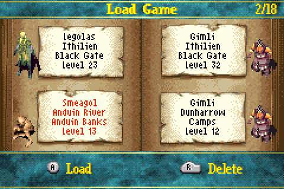
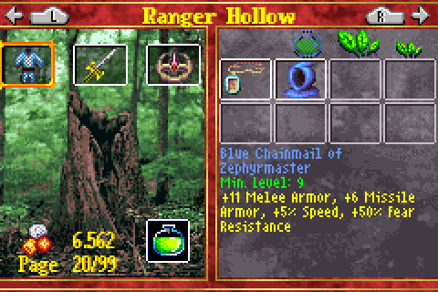
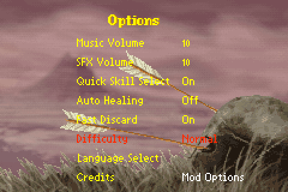
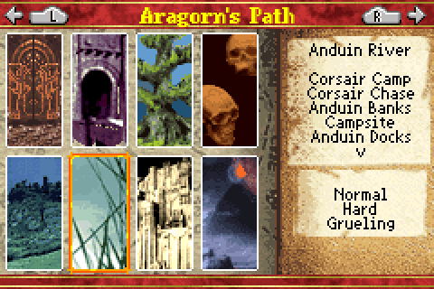
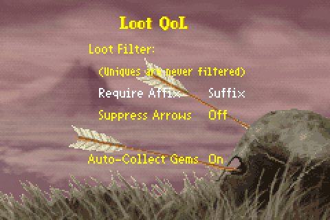
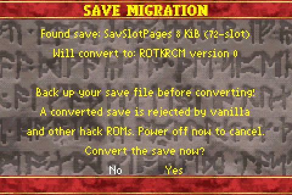

# ROM Hack - End User Documentation

If you encounter issues with the ROM hack or have suggestions, feel free to open an issue or a discussion on this repository or visit the [**LOTR GBA Discord community**](https://discord.gg/yjHm8uf49e).

See the [changelog](./romhack-changelog.md) for more information about what changed between ROM hack releases.

## Patching Instructions

You need a ROM dump of the EU/US version of the game (SHA1: `ec3d126d37ea6e2ad7030d8a99cf87c6e46c03fd`) to patch it successfully.
The Japanese version is unsupported.
Using an otherwise patched ROM as the base is also unsupported.

- Get the latest BPS file from the [latest GitHub release](https://github.com/lotr-gba-re/rotk/releases/latest)
- Go to [https://www.marcrobledo.com/RomPatcher.js/](https://www.marcrobledo.com/RomPatcher.js/)
- Select the original ROM and the BPS file
- Click "Apply patch" and save the patched ROM

If you run into save game issues, read the [save game information](#save-game-information) in this document.

## Features

The overall goal of my patches and changes is to provide a "Vanilla+"-style experience of the original game paired with modern quality of life features.

I currently do not intend to have settings for balancing purposes.
If you think that, for example, the chapter select feature is cheaty, then I ask you to simply not use that feature.

Non-balance features such as the loot filter or gem auto-pickup are configurable.
See the sections below for more information.

### Additional Save Slots

This patch expands the existing 4 save slots to 18 pages of save slots, leading to a total of 72 save slots.
This should be more than enough for your character builds.
This large number of slots was kept to allow compatibility with the original SavSlotPages mod by SuperSaiyajinStackZ.

Behind the scenes this patch was heavily inspired by the original mod, although it's adapted to use my way of creating patches and to use the SRAM backend.

### Ranger Hollow Pages

The Ranger Hollow is expanded from one page to 99 pages.
Pages can be changed one at a time using the L/R buttons.
Holding Start while pressing L/R skips 10 pages at a time.

> [!warning]
> **The Ranger Hollow now saves changes on every page flip or when leaving the screen**.
> This means you can **lose items** if you take them out of the Ranger Hollow and don't save your character.
> While this can also be used to trivially clone items, you were always able to do that by copying your save.
>
> Currently this is done for ease of implementation.
> Depending on feedback I may consider changing it, but I think it's easy to work around it as a player once you know how it works.

### Mod Options

Mod options can be reached using the new menu entry in the options menu.
For now, only the loot quality of life mod has mod settings, but more could come in the future.

### Chapter Select

Chapter select allows you to play other hero's paths as bonus maps once you have beaten the game as the respective hero once.
For the Aragorn/Legolas/Gimli path it's sufficient to beat the game with one of them.
As this re-uses the bonus map mechanism, you won't change your character's current chapter when saving.

You can change between the paths by using the L/R buttons.
You can not only choose the chapter, but also the specific mission/map to start on.
This also applies to bonus maps, so you can now start directly with the second part of Helm's Deep for example.

Side areas or secret areas are not included in the selectable chapters.
Have fun finding those on your own!

> [!warning]
> In missions where you have companions, you will get different companions depending on your hero.
>
> Similarly, you will switch to Sam if you play as Frodo, use chapter select, and encounter the switch point.
> However, if you jump into Sam's maps at a later point as Frodo you will stay Frodo.
>
> Until now I haven't been bothered enough by these issues to fix them.

### Loot Quality of Life

Loot quality of life options can be configured from the mod menu:

#### Auto-Collect Gems

If turned on, gem piles will be automatically picked up if you walk over them, even if they are obstructed by other loot.

#### Loot Filter

The loot filter will prevent certain items from being dropped.
It does not affect the loot rolls and calculations.
It only prevents filtered out items from dropping at the end.
Drop probabilities of non-filtered items are therefore unaffected.
There is no compensation of any sort for filtered items.

###### Require Affix

The following table shows which items can drop (✅) or are filtered out and cannot drop (❌) with specific settings:

| Setting | No prefix or suffix (grey item) | Only prefix (green item) | Only suffix (red item) | Both prefix and suffix (red item) | Unique item (blue) |
| ------- | ------------------------------- | ------------------------ | ---------------------- | --------------------------------- | ------------------ |
| Off     | ✅                              | ✅                       | ✅                     | ✅                                | ✅                 |
| Any     | ❌                              | ✅                       | ✅                     | ✅                                | ✅                 |
| Prefix  | ❌                              | ✅                       | ❌                     | ✅                                | ✅                 |
| Suffix  | ❌                              | ❌                       | ✅                     | ✅                                | ✅                 |
| Both    | ❌                              | ❌                       | ❌                     | ✅                                | ✅                 |

##### Suppress Arrows

| Setting                 | Behavior                         |
| ----------------------- | -------------------------------- |
| Suppress Arrows **Off** | Arrows will be dropped as normal |
| Suppress Arrows **On**  | Arrows will **not** be dropped   |

### Fast Fade

The fast fade patch speeds up scene transitions a bit so flipping between, for example, the game and inventory scene doesn't feel as slow anymore.

### Intro Logo Skip

This patch is mostly in here because the intro logos nearly drove me nuts during debugging.
In this version, the game skips the intro logos and directly launches to the main menu.

### Possible Future Features

- Bugfixes, for example for:
    - Bugged skills such as "Woodsman"
    - Backpack uniques that cannot drop because of a bugged check if they have already dropped in the past
    - Some items marked as fragile not being fragile in practice
- Removing the "uniques can only drop once" rule
    - Item duplication is trivial anyway, denying unique drops is not fun
    - Alternative: Roll another not-yet-dropped unique instead of dropping an orc head/drum or gems. Then clear once the full set has dropped
- Change the GCN link feature to a toggle for Sam and the ancient items

## Save Game Information

This mod changes the save backend from EEPROM (512B or 8KiB) to SRAM (32KiB).
This allows expanding the save game contents beyond vanilla (512B) and the original SavSlotPages mod by SuperSaiyajinStackZ (8KiB).

Because of this, you might need to configure your emulator or flashcart to use SRAM saves.
While the patched ROM is changed to replace the EEPROM marker with the `SRAM_V113` marker (allowing some emulators to correctly auto-detect SRAM save type), some emulators or devices might not detect that.
The ROM tries to check on startup if the SRAM save backend is available.
However, this check is performed on a best-effort basis.
If you have saving issues, start by looking at your emulator/flashcart configuration.

You can use your existing save games from the following ROMs:

- Vanilla RotK
- SavSlotPages mod by SuperSaiyajinStackZ

If one of these save types is detected on startup, the save will be converted to the new format (which I'll call `ROTKRCM` format) automatically.
This works for EEPROM saves in both the block-reversed "VBA-compatible" format and the non-reversed format.
If you use any other mod that does not change the save header, the save type may be misdetected.

> [!warning]
> **Make a backup of your existing save before converting it!**
>
> Saves converted to this mod are **incompatible** with vanilla or SavSlotPages ROMs as well as other ROM hacks.
> **Incompatible** in this case means that the magic bytes in the header are changed and other ROMs will interpret the save as corrupted data and immediately wipe it.
>
> Furthermore, the conversion feature may cause data loss depending on your emulator or a flashcart.
> Please make backups.

The conversion screen looks like this:

